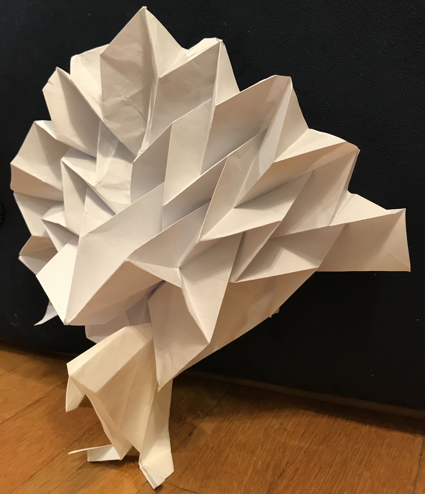

# Origami crease patterns for the Miura fold

This is a [Squeak Smalltalk](https://squeak.org/) implementation of a simple algorithm to generate origami crease patterns (folding diagrams) for the [Miura fold](https://en.wikipedia.org/wiki/Miura_fold). The Miura fold is a method to: 

- Fold a sheet of paper into a smaller area by pushing the paper's diagonally opposite ends in one motion, and
- Unpack the folded paper in one motion by pulling on its opposite ends. 

Its folding and unfolding are very satisfying! 

  

This Squeak code can generate the crease patterns of the Miura fold, which form a tessellation of parallelograms. If you print out a generated crease pattern on a sheet of paper (a letter-sized paper, for example), it helps you experience and complete the Miura fold. 

  

The Miura fold was used for a [spacecraft](https://en.wikipedia.org/wiki/Space_Flyer_Unit) to fold its large solar panel array before launch (so that it can reduce its volume and fit in the space of a rocket) and unfold the panel array in space. 

  

It is also used in many origami crafts. For example, here is a peacock that I folded. Its tail is expressed with the zig-zag structure of the Miura fold. 

  

This code base is pushed to GitHub with Squeak's Git Browser ([Squot](https://github.com/hpi-swa/Squot)). The GeoBot class is implemented by customizing a class that is covered in Stephane Ducasse's awesome book ["Squeak: Learn Programming with Robots"](https://smile.amazon.com/Squeak-Programming-Robots-Technology-Action/dp/1590594916/).

I wrote this code in August 2019 to work on a summer research project about the Miura fold. See a research report and a [poster presentation](images/poster.jpg), both written in Japanese, if you can read Japanese. :smile: 
